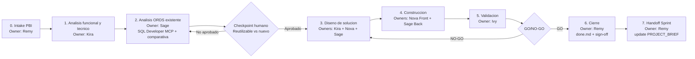
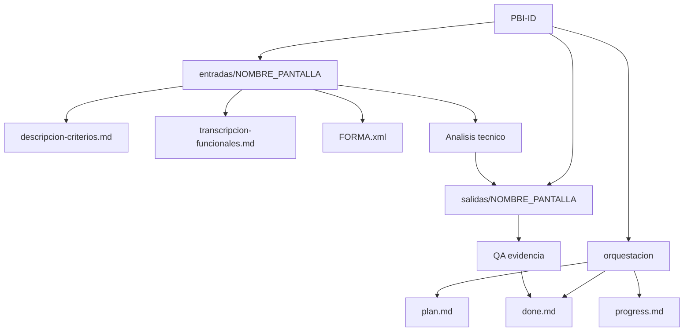
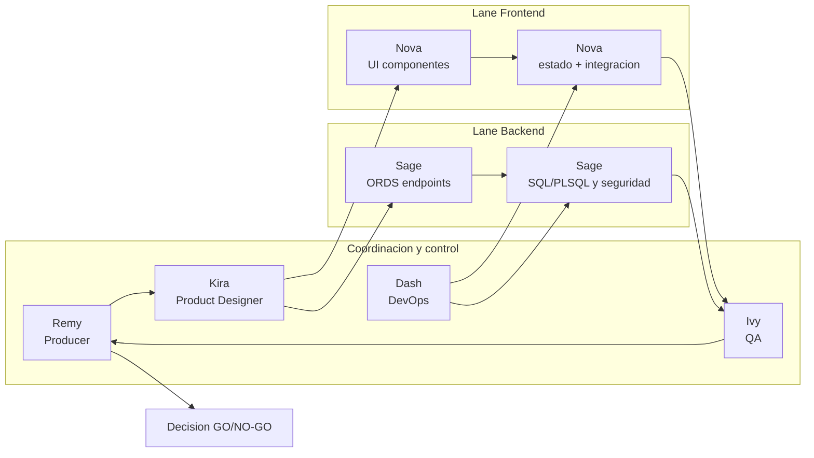
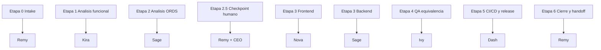
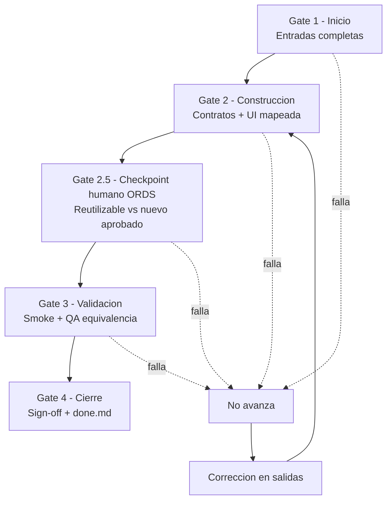

# Visual - Flujo Integral del Proyecto

Owner: Remy
Estado: ACTIVO
Objetivo: Material visual explicito para presentar el flujo completo del proyecto de punta a punta.

## 1) Etapas Macro (End-to-End)

## 2) Flujo Operativo por PBI (Estructura de Carpetas)

## 3) Flujo por Roles (Orquestacion AI Team)

## 4) Mapa Etapa -> Agente Responsable

## 5) Gates de Control (Obligatorios)

## 6) Uso en Presentacion

1. Abrir este archivo en VS Code para render Mermaid.
2. Presentar en este orden: Macro -> PBI -> Roles Front/Back -> Etapa/Agente -> Gates.
3. Cerrar con estado actual del sprint y proximo hito.

## 7) Referencias

- `PROJECT_BRIEF.md`
- `docs/intake/README.md`
- `docs/intake/guia-arranque-pbi.md`
- `docs/governance/plan-accion-anti-ahogo.md`
